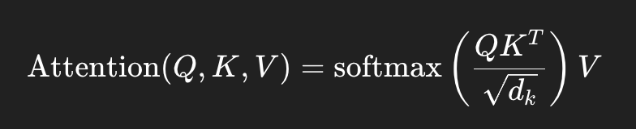

# Abstract  

## Before Transformer  
- Models used **RNNs** and **CNNs** with an **encoder–decoder** structure.  
- The best models added **attention** as an extra helper to improve translation accuracy (introduced around **2014–2015**).  

## Transformer Innovation  
- Introduced a new model built **only on attention**, with no recurrence (RNNs) or convolutions (CNNs).  
- Achieves **faster training** and **better performance** than older models.  

# Introduction
- **RNN**,**LSTM**, and **GRU** have been state-of-the-art methods for sequence modeling and tasks like langugae modeling and machine translation.
- Many works have improved recurrent language models and **encoder-decoder** architecture.
- But RNNs pricess data sequentially, which makes training slow and hard to parallelize, especially for long sequences.
- Attention mechanims were added to help capture **long-range dependencies**, but usually still used alongside RNNs.
- The Transformer was proposed to remove recurrence completely, relying only on attention for modeling sequences.

# Background
- Earlier models like **Extended Neural GPU**, **ByteNet** and **ConvS2S** tried to reduce sequential by using **CNNs** instead of RNNs.
- These CNN-based models process all positions in parallel, but the cost of relating distant positions grows with distance (linear for ConvS2S, logarithmic for ByteNet).
- This make learning **long-range dependencies** harder.
- The Transformer reduces this cost to a constant, by replacing recurrence with self-attention, allowing the model to look at all positions in the sequence simultaneously.
- This Self-attention computes a weighted sum of all token representation. Notice that each token ends up with a mixture(average) of other token features.

    ### Self-Attention

    Self-attention computes a weighted sum of all token representations using the query (Q), key (K), and value (V) matrices:

    

    Where:  
    - \(Q\) = Query matrix  
    - \(K\) = Key matrix  
    - \(V\) = Value matrix  
    - \(d_k\) = Dimension of the key vectors (used for scaling)

- This averaging is powerful for capturing global context, but can sometimes blur fine-grained details.
    Example: Subtle difference between similar words or positions in long sequences may be diluted.

